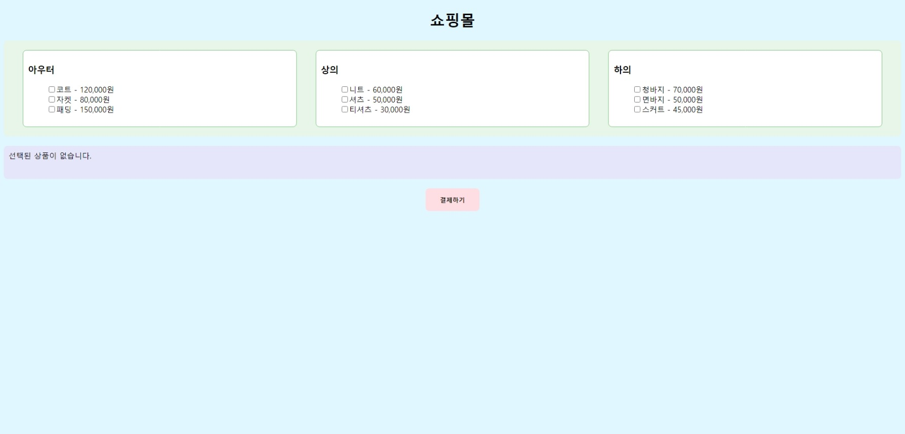
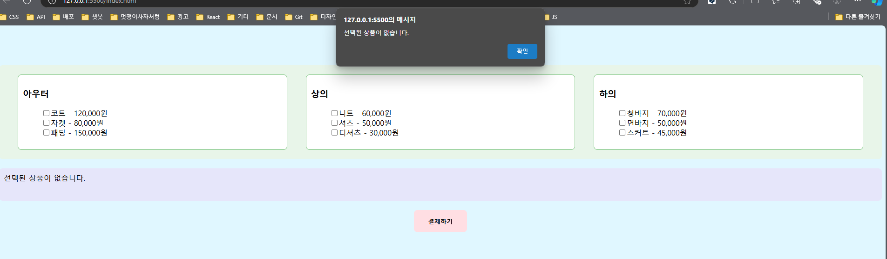
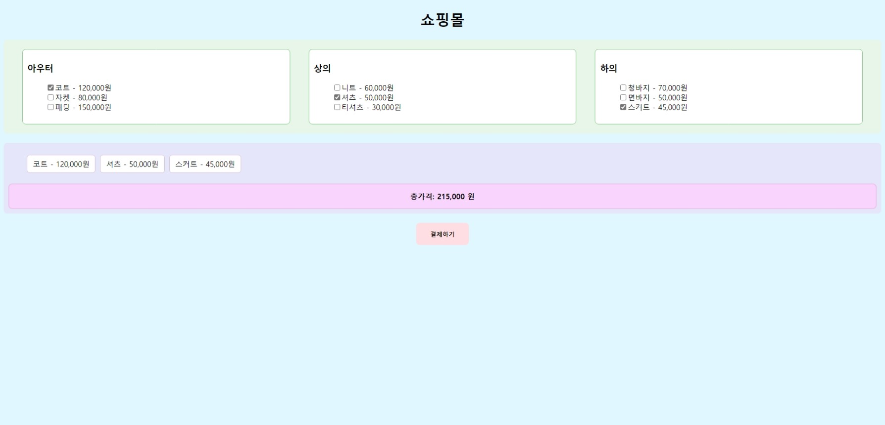
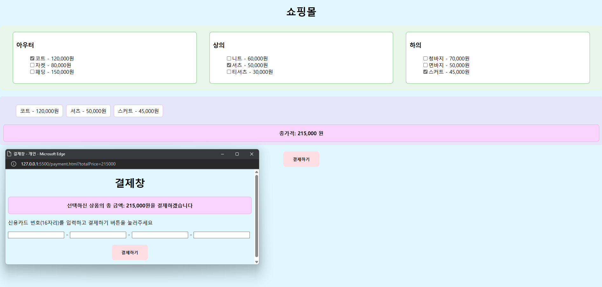
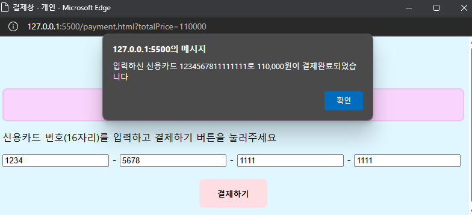

# 멋쟁이사자처럼 프론트엔드 11기

## 자바스크립트 1차 과제: 쇼핑몰 내 물건 구매

### 기능 요구 사항

1. **상품 정보 출력**
   - JS를 사용하여 여러 개의 상품 정보를 화면에 출력합니다.
   - 사용자는 원하는 상품을 선택할 수 있어야 합니다.

2. **선택된 상품 정보**
   - 사용자가 상품을 선택하면 현재 선택된 상품 목록과 총 가격이 실시간으로 계산되어 화면에 출력됩니다.

3. **결제 버튼 동작**
   - 선택된 상품이 없는 상태에서 결제하기 버튼을 클릭하면, 
     - `alert("결제할 상품을 선택해야 합니다");` 메시지가 표시됩니다.
   - 상품이 선택된 상태에서 결제하기 버튼을 클릭하면,
     - 새로운 윈도우 창이 열리며 결제창이 화면에 출력됩니다.

4. **결제 처리**
   - 결제창에서 신용카드 번호를 입력하고 결제 버튼을 클릭하면,
     - 결제가 성공되었다고 가정합니다.
     - 기존 결제창은 닫히고, 결제 내용이 `alert`으로 출력됩니다.
     - 확인 버튼을 클릭하면 초기 화면으로 돌아갑니다.

---

## 결과 화면

아래는 쇼핑몰과 결제 창 관련 화면입니다.
1. **초기 쇼핑몰 화면**
   

2. **상품을 선택하지 않은 경우**
   

3. **상품 선택 후 전체 화면**
   

4. **상품을 선택하고 결제 창을 띄운 경우**
   

5. **카드 번호에 숫자가 아닌 문자가 포함된 경우**
   

6. **카드 번호를 모두 입력하지 않은 경우**
   

7. **카드 번호가 올바르게 입력된 경우**
   

### 배포 링크
https://ohdaseul.github.io/likelion_shopping-mall-cart/