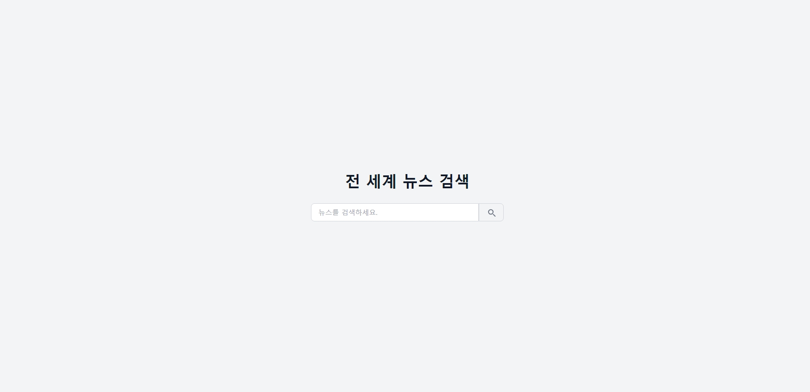
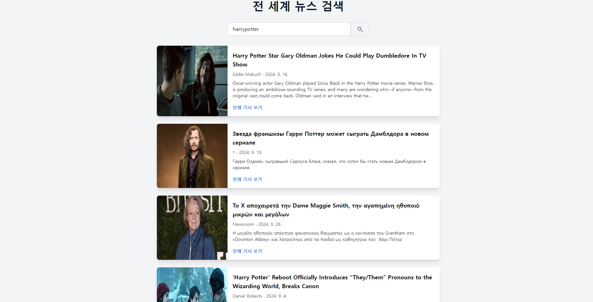
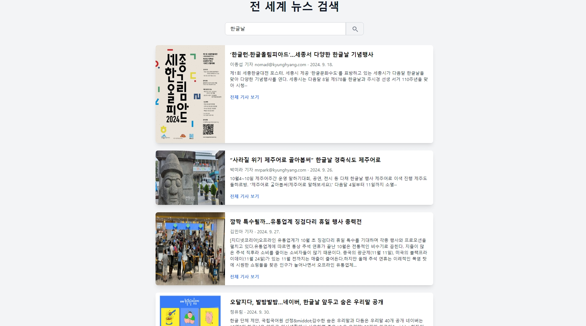
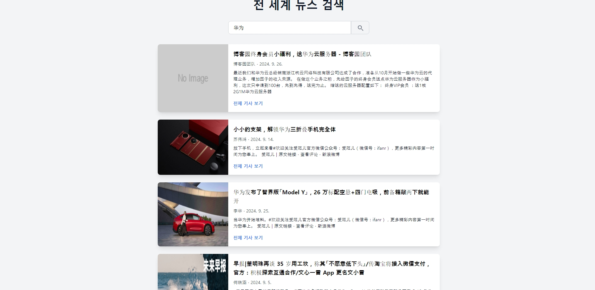
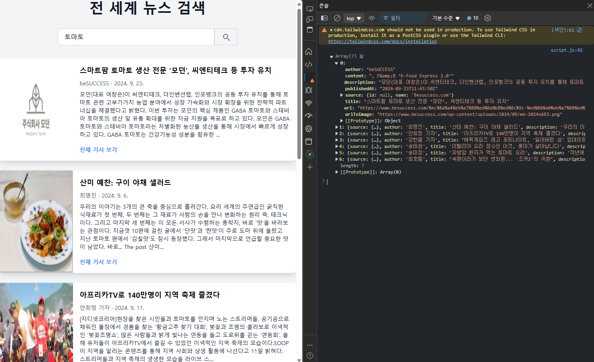
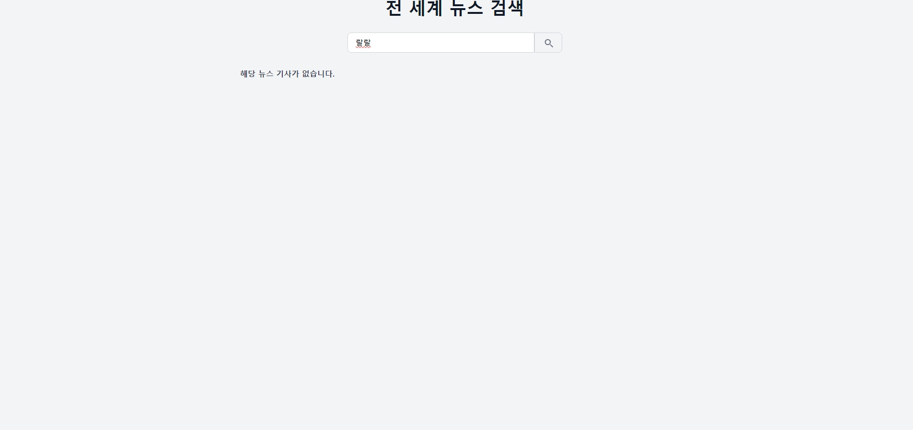

# 멋쟁이사자처럼 프론트엔드 11기

## 자바스크립트 2차 과제 : 뉴스 검색 프로젝트

### 주요 기능
1. **뉴스 검색 입력창 및 버튼**
    - 사용자가 검색어를 입력하고, 검색 버튼을 클릭하여 뉴스를 검색할 수 있습니다.
2. **뉴스 검색 결과 출력**
    - 입력한 검색어에 따라 News API로부터 결과를 받아 화면에 뉴스 리스트를 출력합니다.
3. **뉴스 상세보기**
    - 각 뉴스 항목에 URL이 제공될 경우, "more" 링크를 통해 실제 뉴스 페이지로 이동할 수 있습니다.

### 요구사항
1. **검색창과 버튼**
    - 사용자는 검색어를 입력하고, 버튼을 클릭하여 뉴스를 검색할 수 있어야 합니다.
2. **AJAX를 통한 데이터 요청**
    - `News API`에서 데이터를 받아와서 화면에 뉴스 리스트를 출력합니다.
3. **상세보기**
    - 뉴스 항목의 URL을 통해 뉴스 사이트로 이동할 수 있는 "more" 링크를 제공합니다.

### 프로젝트 실행 방법
1. [News API](https://newsapi.org)에 가입하여 API Key를 발급받습니다.
2. 프로젝트 파일을 로컬 환경에 클론합니다.
3. 프로젝트 내 JavaScript 파일에서 발급받은 API Key를 입력합니다.
4. 브라우저에서 `index.html` 파일을 열어 프로젝트를 실행합니다.

### 사용된 기술
- HTML
- CSS (Bootstrap 또는 사용자 정의 CSS 가능)
- JavaScript
- AJAX (비동기 통신)
- [News API](https://newsapi.org)

## 결과 화면

### 초기 화면

### 뉴스 검색 결과 화면
- 영어 검색 결과: 
- 한국어 검색 결과: 
- 중국어 검색 결과: 

### 뉴스 기사 결과를 출력한 콘솔 로그 화면

### 검색 결과 없는 상태

### 해당 기사의 원문 보러가기

---